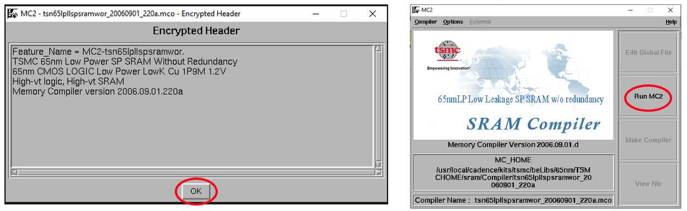
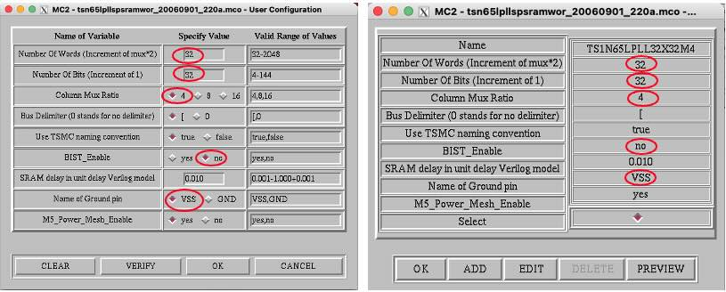
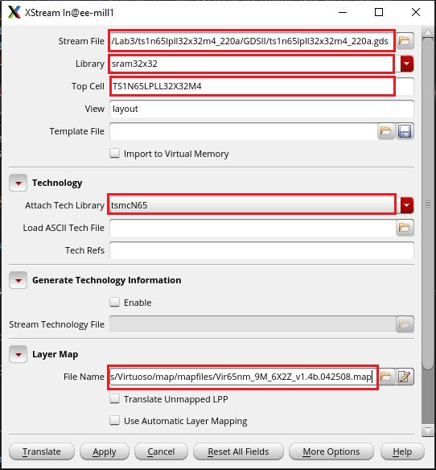
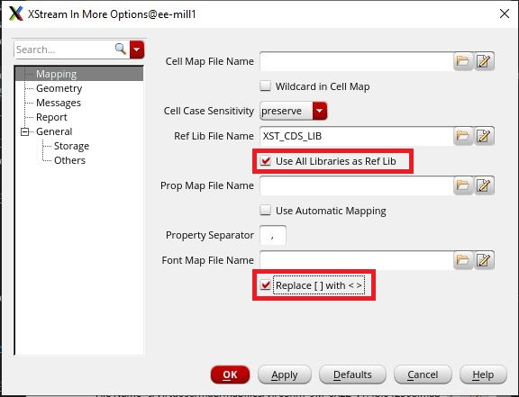
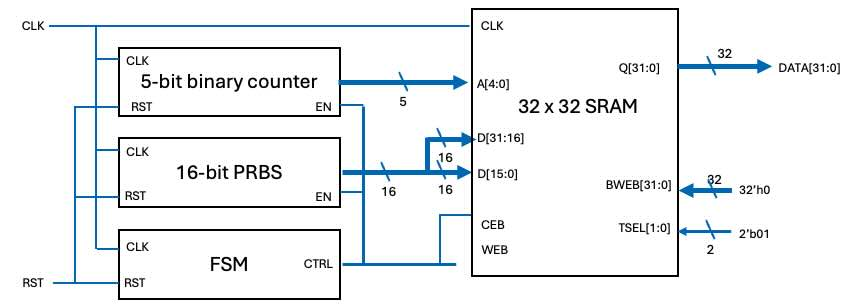

##### Imperial College London, Department of Electrical & Electronic Engineering


#### ELEC70142 Digital VLSI Design

### Lab 3 - Memory and Self-test

##### *Peter Cheung, v1.0 - 23 October 2025*

---
### Objectives
---
By the end of this laboratory session, you should be able to do the following.
* Use TSMC's memory compiler tool to generate efficient memory.
* Integrate a block of logic implement using standard cells with generated memory.
* Verify that the entire system works properly using built-in self-test.

---
### Task 1 - Generate 32 x 32 SRAM 
---

This task is about using TSMC's 65nm memory compiler tool to generate a SRAM block.  You can find the documentation relating to this at:
```bash
/usr/local/cadence/kits/tsmc/beLibs/65nm/TSMCHOME/sram/Documentation/documents/
```

**_Step 1: Launch the memory compiler_**

* Create a new directory for this lab, say, LAB_3 and change to that directory.
* Launch TSMC's pdk with:
``` bash
pdk TSMC65LP
```
* Launch TSMC's **Memory Compiler** with:
``` bash
tsmcmemcomp spsram
```
>The argument **_spsram_** generates a single port RAM with a write port with its own write address and data input, and one read port with its own read address and data out.
>The argument **_dpsram_** generates a dual port RAM with a single write port (own addresa and data), and two separate read ports.

* Clck **_OK_** and **_Run MC2__** in the pop-up windows.

<p align="center">  </p><BR>

**_Step 2: Specify configuration for the memory_**

1. In the dialogue box select "netlist" and click "Enter User Defined Configuration variable".
2. A form will popup with default memory parameters. Click **_Edit_**.
3. Change the variables to the following:
   * Number of Words = 32
   * Number of Bits = 32
   * Column Mux Ratio = 4
   * Name of Ground pin = VSS
   * BIST_Enable = no
   * Check that the memory parameters you selected match that in the diagram below.

<p align="center">  </p><BR>

4. Set the operating point to typical by clicking **_Other Options_** button at the top to reveal the operating point selections. Click **_Next_**, and select **_tt1p2v25c_** to set the operating point to 1.2V and 25 degrees C.
5. Click **_OK_** then **_PREVIEW_**.  You will see a bounding box showing the size of the memory produced by the memory compiler. Record the dimension in your logbook.
6. In the Configuration window, click **_AutoName Memory_** button.
7. Select the **_Models_** option at the top and click **_Select ALL_** to generate the full set of models.
8. Finally, click **_Run_** to run the compiler. Then click **_Quit_** to exit the Memory Compiler programme.

Examine the directory for this lab and the files automatically generated by the memory compiler.  

> In particular, examine the Verilog netlist file for the memory block. Especially, record in your logbook the names of the input/output ports and their purposes. 

**_Step 3 - Examine the layout of the memory block_**

>The following procedure imports the GDS II layout into the Virtuoso layout editor. With this procedure, you can examine the layout produced by the Memory Compiler or the standard cell design produced by Innovus PnR tools.

* Launch Virtuoso with **_"cadence &"_**.
* Create a new library with: **_Library -> Manager -> File - > New -> Library_**.
* Attach to an existing technology library -> tsmcN65
* From Virtuoso main window, click **_ File -> Import -> Stream_**. An XStream dialogue box will pop up.
* Fill in the required entry of the dialogue box with:
1. **Stream file**: the layout generated by the memory compiler saved in the folder GDSII.
2. **Library**: The library just created.
3. **Topcell**: name of the memory verilog module. 
4. **Attach tech library**: tsmcN65
5. **Layer Map - File Name**: /usr/local/cadence/kits/tsmc/beLibs/65nm/TSMCHOME/digital/Back_End/lef/tcbn65lpbwp7t_141a/techfiles/Virtuoso/map/mapfiles/Vir65nm_9M_6X2Z_v1.4b.042508.map
6. Click **_Apply_** or **_Translate_**. Ignore the warnings.
7. From the Library Manager, select the memory library. Scroll down to the Cell with the topmodule name. 
8. Open the **Layout**s view. You will see a blue rectangle.
9. Hide VIA1 VIA2 VIA3 layers to reveal the circuit layout.

<p align="center">    </p><BR>

---
**_Task 2: Combine memory block with standard cell design_**
---

The purpose of this task is to synthesis a block of logic with Genus, place and route this with Innovus **together** with the memory block.

**_Step 1: Specify logic circuit in SystemVerilog_**

<p align="center">  </p><BR>

The block diagram shows the 32 x 32-bit SRAM created in Task 1 surrounded by three modules:
1. A 5-bit address counter.
2. A 16-bit PRBS generator (from Lab 1). The random output from the PRBS generator is used as data to upper and lower 16-bit words of the memory.
3. A FSM that produces the necessary control signals.  The FSM should write 32 words generated by the PRBS to fill the SRAM. It should then read the 32 words stored. Then it should write the next 32 words before reading them out etc..

>Note that CEB (Chip Enable) and WEB (Write Enable) signals are active low (hence the letter 'B').

Design these three modules in SystemVerilog and create a top-level design to combine these four blocks to implement the circuit shown.

**_Step 2: Synthesize the design with Genus_**

* Use **_Genus_** to synthesize the combined circuit into a structural model.
* Modify the **_synth.tcl_** file from Lab 1 including the appropriate design files, memory libraries and any other required change.

**_Step 3: Generate the physical layout with Innovus_**
* Modify the **_PnR_** file from Lab 1 to place and route the design with **_Innovus_**.
  
  You might need to change the script settings, add memory libraries and modify the mmmc script.
  
  After you have initialised the design with the command `init_design`, you can visualise the macro blocks (such as the memory included in your design) using the button  on the top right corner. You might need to change the die area aspect ratio or dimensions to fit the memory.
  
  Macro blocks can be moved inside the die area using button  in the top left corner or the command `placeInstance`. After the macros have been placed, add the power ring around the memory block using `addRing`. Use `addHaloToBlock` to add a placement blockage to ensure standard cells and routing are kept away from the macro edges. 

  > To know more about the commands, refer to the Cadence documentation ([here](http://www.ee.ic.ac.uk/pcheung/teaching/EE4_VLSI/document_locations.pdf)) or use `man <command>` from the Innovus UI.

* Generate a GDS II file to export the design using the following command:
  ```tcl
  streamOut OUTPUTS/${DESIGN}.gds -structureName ${DESIGN} \
                                  -mode ALL  \
                                  -attachInstanceName 13 -attachNetName 13 \
                                  -dieAreaAsBoundary \
                                  -merge { \
                                      <path to the memody gdsII file>\
                                      } \
                                  -mapFile "/usr/local/cadence/kits/tsmc/beLibs/65nm/TSMCHOME/digital/Back_End/lef/tcbn65lpbwp7t_141a/techfiles/gds2.map"
  ```
* Use the procedure in Task 1 of this lab to import the GDS II layout of the PnR circuit. Examine the layout in **_Virtuoso_**.

**_Step 4: Design a testbench_**
* Design a testbench to test this circuit using **_ncverilog_**.

---
### The Challenge
___

<p align="center">  </p><BR>

The system above is an extension of the circuit in Task 2 with a built-in self-test circuit. Instead of inspect the output from the simulator, this circuit  compresses the SRAM output sequence to produce an expected 16-bit signature. Deviation from the expectation indicates an error in the circuit.

In Lab 1, you designed a serial signature analyzer that compress sequence of '1's and '0's to a 16-bit signature.  This circuit can be modified into a parallel signature analyzer that produces a unique signature for a 16-bit, instead of 1-bit, input using the circuit shown below.

<p align="center">  </p><BR>

This circuit "merges" the 16-bit signature of DUT to the LFSR to produce the signature.  

SRAM data output is 32-bit.  One possibility is to XOR neighbouring two bits and feed outputs of the 16 XOR gates to the parallel signature analyzer.

You will also need to modify the FSM to ensure that a test cycle is performed whenever the test input command goes from low to high, and produces the 16-bit signature. This can then be compared with the expected value and produces a GO/NO_GO output.


