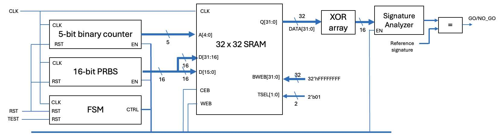
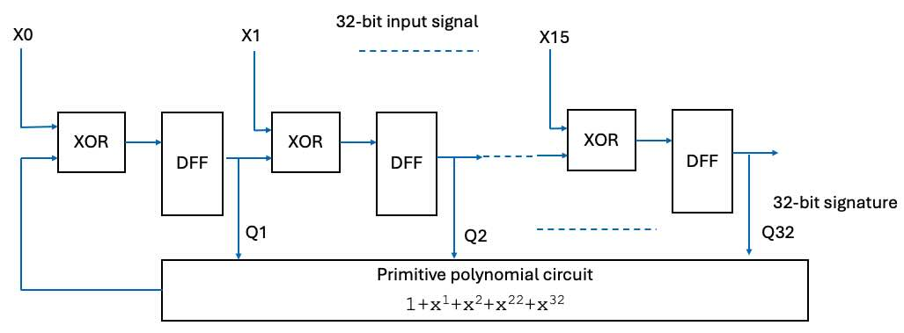

##### Imperial College London, Department of Electrical & Electronic Engineering


#### ELEC70142 Digital VLSI Design

### Lab 4 - Self-test System

##### *Peter Cheung, v1.0 - 30 October 2025*


This laboratory session is a continuation from Lab 3.  In this lab, using knowledge from Labs 1 to 3, you will develop a built-in self-test circuit to detect possible error in the circuit.  You will also inject errors into the circuit to check that the automatic fault detection circuit works.

* Create a new directory for this lab, say, LAB_4 and move to that directory.
* Copy the folder containing the memory block designed in Lab 3 to this folder.
* Launch TSMC's pdk with:
``` bash
pdk TSMC65LP
```

<p align="center">  </p><BR>

The system above is an extension of the circuit in Lab 3 Task 2 with a built-in self-test circuit. Instead of inspect the output from the simulator, this circuit  compresses the SRAM output sequence to produce an expected 16-bit signature. Deviation from the expectation indicates an error in the circuit.

In Lab 1, you designed a serial signature analyzer that compress sequence of '1's and '0's to a 16-bit signature.  This circuit can be modified into a parallel signature analyzer that produces a unique signature for a 32-bit, instead of 1-bit, input using the circuit shown below.

<p align="center">  </p><BR>

This parallel signature analyzer circuit "merges" the 32-bit output values from the SRAM with the LFSR Q outputs, and produces a signature for stored contents in the SRAM.

You will also need to modify the FSM to ensure that a test cycle is performed whenever the test input command goes from low to high, and produces the 32-bit signature. This can then be compared with the expected value and produces a GO/NO_GO output.

> [Here](https://www.partow.net/programming/polynomials/index.html#deg32) is a useful reference on  primitive polynomials for degrees 3 to 32.

Check that your self-test circuit works by connecting one of the data output of the SRAM to ground, thus injecting a stuck-at-0 fault into the circuit.


---
#### Challenge (if you have time)
---

You can synthesis a 32x32 SRAM using registers in standard cell.  Write a 32x32 SRAM block in SystemVerilog and use Genus and Innovus to create the layout.  Compare the size and timing for this synthesized SRAM with the layout generated by TSMC's memroy compiler.